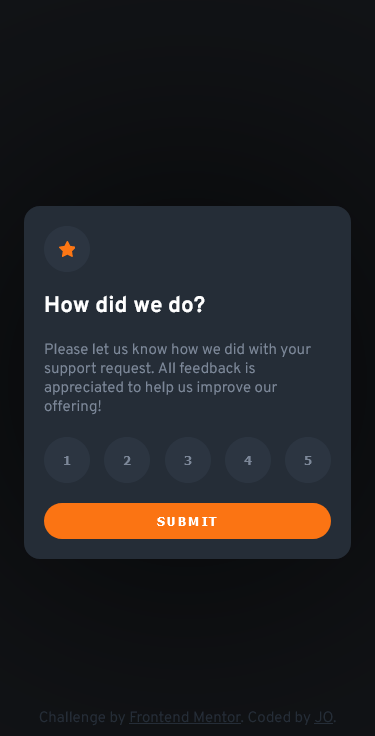
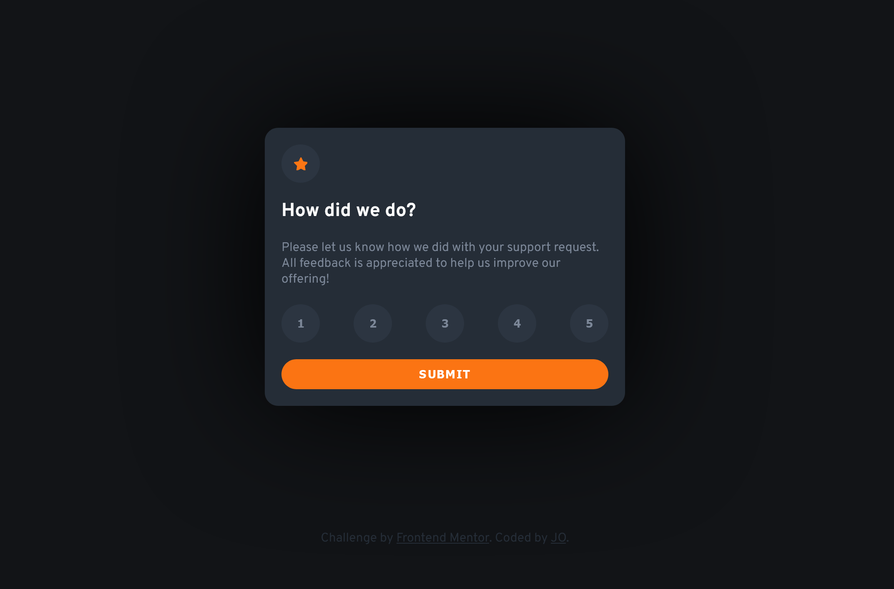

# Frontend Mentor - Interactive rating component solution

This is a solution to the [Interactive rating component challenge on Frontend Mentor](https://www.frontendmentor.io/challenges/interactive-rating-component-koxpeBUmI). Frontend Mentor challenges help you improve your coding skills by building realistic projects. 

## Table of contents

- [Overview](#overview)
  - [The challenge](#the-challenge)
  - [Screenshot](#screenshot)
  - [Links](#links)
- [My process](#my-process)
  - [Built with](#built-with)
  - [What I learned](#what-i-learned)
- [Author](#author)


## Overview

### The challenge

Users should be able to:

- View the optimal layout for the app depending on their device's screen size
- See hover states for all interactive elements on the page
- Select and submit a number rating
- See the "Thank you" card state after submitting a rating

### Screenshot






### Links

- Solution URL: [Github repo](https://github.com/myspace8/interactive-rating-component-main)
- Live Site URL: [View it live](https://myspace8.github.io/interactive-rating-component-main/)

## My process

### Built with

- Semantic HTML5 markup
- CSS custom properties
- Flexbox
- Mobile-first workflow
- JavaSript

### What I learned

I didn't want to reapeat myself by asigning the same 'class name' to each button. So I used 'forEach' method.

Using the 'forEach' was really helpful. I was able to target each button and addEventListener to them individually. 
The event listens for a click of a button and runs a function to get the value I assigned to it in the HTML. 

```js
rateBtn.forEach(button => {
    button.addEventListener('click', () => {
        rateNumberSelected.innerHTML = button.value;
    })
});
```

NOTE:

This couldn't be possible without using 'querySelectorAll'...
```js
querySelectorAll('rate-btn button');
```
... to select only the buttons inside the 'rate-btn' 

```html
<div class='rate-btn'>...</div> 
```


## Author

- Frontend Mentor - [@Joe](https://www.frontendmentor.io/profile/myspace8)
- Twitter - [@owoahene_joseph](https://twitter.com/owoahene_joseph)

